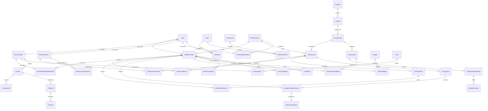

# Database Schema & Entity Design: Kids Arabic Academy

Kids Arabic Academy uses **PostgreSQL** managed through **Prisma ORM**. All tables utilize UUID primary keys, timestamp tracking, and soft-delete/status fields.

---

## 1. Entity Relational Map

---

## 2. Core Tables Overview

### Identity & Access Control
- `users`: Core credentials and state (`id`, `email`, `passwordHash`, `status`: `PENDING_VERIFICATION | ACTIVE | SUSPENDED | ARCHIVED`, `mfaEnabled`, `localePreference`, `createdAt`, `updatedAt`).
- `roles`: `SUPER_ADMIN`, `SCHOOL_ADMIN`, `ACADEMIC_ADMIN`, `FINANCE_ADMIN`, `TEACHER`, `PARENT`, `STUDENT`, `SUPPORT_AGENT`.
- `permissions`: Fine-grained actions (`classes:write`, `attendance:record`, `grades:publish`, etc.).
- `audit_logs`: Immutable security log (`userId`, `action`, `resource`, `resourceId`, `diffJson`, `ipAddress`, `createdAt`).
- `rate_limit_attempts`: Sliding window rate limit tracker (`key`, `createdAt`).
- `password_reset_tokens` & `email_verification_tokens`: SHA-256 hashed one-time tokens with 24h expiry.

### Multi-Tenant B2B Domain
- `partner_schools`: `id` (slug), `nameAr`, `nameEn`, `type` (`ISLAMIC_SCHOOL | COMMUNITY_CENTER | HOMESCHOOL_COOP`), `licenseSeatsTotal`, `licenseSeatsUsed`, `contractStatus`.
- `administrator_profiles`: `userId`, `scope`, `schoolId` (scoped for `SCHOOL_ADMIN`).

### People & Relationships
- `student_profiles`: `userId`, `firstName`, `lastName`, `dateOfBirth`, `gender`, `nationality`, `nativeLanguage`, `ageGroup`, `notesInternal`, `schoolId`.
- `parent_profiles`: `userId`, `firstName`, `lastName`, `phoneNumber`, `billingAddress`, `stripeCustomerId`.
- `teacher_profiles`: `userId`, `qualifications`, `certifications`, `experienceYears`, `hourlyRateMinorUnits`, `languagesSpoken`, `isCertified`, `employmentType`.
- `parent_student_relationships`: `parentId`, `studentId`, `relationshipType`, `isPrimaryContact`, `consentGivenAt`.

### Academic & Assessment Domain
- `programs`: 7 core tracks (`ARABIC_FOUNDATIONS`, `READING_PROGRAM`, `WRITING_PROGRAM`, `SPEAKING_PROGRAM`, `LISTENING_PROGRAM`, `QURAN_TAJWEED`, `ISLAMIC_STUDIES`).
- `courses` & `course_levels`: CEFR mapped levels (`PRE_A1`, `A1`, `A2`, `B1`, `B2`).
- `class_groups`: Cohorts capped at max 6 students (`name`, `courseLevelId`, `capacityMax`, `schoolId`).
- `assessments` & `assessment_questions`: Supports 7 question types (`MULTIPLE_CHOICE`, `TRUE_FALSE`, `MATCHING`, `FILL_BLANK`, `ESSAY`, `AUDIO_RESPONSE`, `VOICE_RECORDING`).
- `live_session_grades`: Real-time teacher evaluation per session (`wordsPerMinute`, `makharijScore`, `participationStars`, `teacherNotesAr`).

### Financial Domain (Minor Units)
- `plans`: `type` (`INDIVIDUAL | FAMILY | GROUP | PRIVATE_1_ON_1`), `priceMinorUnits` (integer cents), `interval` (`MONTHLY | QUARTERLY | ANNUALLY`).
- `subscriptions`: `parentId`, `planId`, `status`, `stripeSubscriptionId`.
- `invoices` & `invoice_items`: `subtotalMinorUnits`, `taxMinorUnits`, `totalMinorUnits`, `status` (`DRAFT | ISSUED | PAID | VOID`).
- `payments` & `refunds`: `provider`, `providerTransactionId`, `amountMinorUnits`, `idempotencyKey`.
- `teacher_compensations`: `hoursTaught`, `rateMinorUnits`, `bonusMinorUnits`, `totalMinorUnits`, `isPaid`.
