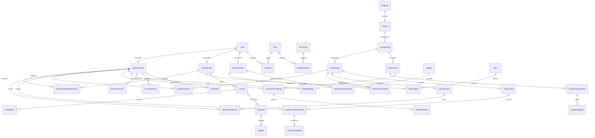

# Database Schema & Entity Design: Kids Arabic Academy

Kids Arabic Academy uses **PostgreSQL** managed through **Prisma ORM**. All tables utilize UUID primary keys, timestamp tracking, and soft-delete/status fields.

---

## 1. Entity Relational Map

---

## 2. Core Tables Overview

### Identity & Access Control
- `users`: Core credentials and state (`id`, `email`, `password_hash`, `status`: `PENDING | ACTIVE | SUSPENDED | ARCHIVED`, `mfa_enabled`, `locale_preference`, `created_at`, `updated_at`).
- `roles`: `SUPER_ADMIN`, `SCHOOL_ADMIN`, `ACADEMIC_ADMIN`, `FINANCE_ADMIN`, `TEACHER`, `PARENT`, `STUDENT`, `SUPPORT_AGENT`.
- `permissions`: Fine-grained actions (`classes:write`, `attendance:record`, `grades:publish`, etc.).
- `audit_logs`: Immutable security log (`actor_id`, `action`, `resource`, `resource_id`, `diff_json`, `ip_address`, `created_at`).

### People & Relationships
- `student_profiles`: `user_id`, `first_name`, `last_name`, `date_of_birth`, `gender`, `nationality`, `native_language`, `current_level_id`, `age_group` (`AGE_4_6 | AGE_7_10 | AGE_11_13 | AGE_14_16`), `notes_internal`.
- `parent_profiles`: `user_id`, `first_name`, `last_name`, `phone_number`, `emergency_contact_name`, `emergency_phone`, `billing_address`.
- `teacher_profiles`: `user_id`, `bio_en`, `bio_ar`, `qualifications`, `certifications`, `experience_years`, `hourly_rate_minor_units`, `languages_spoken`, `is_active`.
- `parent_student_relationships`: `parent_id`, `student_id`, `relationship_type` (`FATHER | MOTHER | GUARDIAN`), `is_primary`, `consent_given_at`.

### Academic Programs & Curriculum
- `programs`: Track categories:
  - `ARABIC_FOUNDATIONS`
  - `READING_PROGRAM`
  - `WRITING_PROGRAM`
  - `SPEAKING_PROGRAM`
  - `LISTENING_PROGRAM`
  - `QURAN_TAJWEED`
  - `ISLAMIC_STUDIES`
- `courses`: Specific course catalog (`title_en`, `title_ar`, `program_id`, `target_age_group`).
- `course_levels`: Proficiency stages (`PRE_A1`, `A1`, `A2`, `B1`, `B2`, etc.).
- `curriculum_units` & `lessons`: Systematic learning units, phonics exercises, story modules, Tajweed rules.
- `class_groups`: Cohorts (`name`, `course_level_id`, `capacity_max` [default 6], `meeting_provider`, `class_type`: `GROUP | PRIVATE_1_ON_1`).
- `class_enrollments`: Student membership (`student_id`, `class_group_id`, `enrolled_at`, `status`).
- `teacher_assignments`: Teacher assignments to class groups (`PRIMARY | ASSISTANT | SUBSTITUTE`).

### Scheduling & Attendance
- `class_sessions`: Scheduled lesson occurrences (`class_group_id`, `teacher_id`, `start_time_utc`, `end_time_utc`, `join_url`, `status`: `SCHEDULED | IN_PROGRESS | COMPLETED | CANCELLED | RESCHEDULED`).
- `attendance_records`: `session_id`, `student_id`, `status` (`PRESENT | LATE | EXCUSED_ABSENCE | ABSENT`), `recorded_by_teacher_id`, `notes`.

### Assignments & Assessments
- `assignments`: Homework projects (`title`, `instructions`, `due_date_utc`, `voice_prompt_url`).
- `assignment_submissions`: Student submission (`audio_url`, `text_body`, `submitted_at`, `status`).
- `teacher_feedbacks`: `score`, `internal_diagnostic_notes`, `parent_visible_feedback`.
- `assessments`: `assessment_type` (`PLACEMENT_TEST | WEEKLY_QUIZ | MONTHLY_EXAM | MIDTERM | FINAL_EXAM`).
- `assessment_questions`: `question_type` (`MULTIPLE_CHOICE | TRUE_FALSE | MATCHING | FILL_BLANK | ESSAY | AUDIO_RESPONSE | VOICE_RECORDING`).
- `question_options`: Answer choices and correct answer markers.
- `assessment_attempts`: Student exam session and overall grade.
- `student_answers`: Specific student responses, scored by rubric or auto-grader.

### Gamification & Engagement
- `badges`: Achievement definitions (`title_en`, `title_ar`, `icon_url`, `category`, `xp_reward`). Key badges include `Reading Champion`, `Grammar Master`, `Quran Star`, `Perfect Attendance`.
- `student_badges`: Earned badges with award timestamp.
- `point_transactions`: XP ledger (`student_id`, `points_delta`, `reason`: `ATTENDANCE | HOMEWORK | EXAM | STREAK`).
- `learning_streaks`: Daily and weekly active streak counters.
- `certificates`: Tamper-evident verifiable completion documents (`verification_code`, `student_name_snapshot`, `course_name_snapshot`, `qr_code_payload`, `pdf_url`).

### Financial Management
- `plans`: `plan_type` (`INDIVIDUAL | FAMILY | GROUP | PRIVATE_1_ON_1`), `billing_interval` (`MONTHLY | QUARTERLY | ANNUALLY`).
- `prices`: Integer minor units (e.g. 7500 = $75.00), currency (`EUR`, `USD`, `SAR`, etc.).
- `subscriptions`: Active subscriptions tied to Parent (`status`, `current_period_start`, `current_period_end`).
- `invoices`: Immutable billing documents (`invoice_number`, `parent_id`, `subtotal_minor_units`, `tax_minor_units`, `total_minor_units`, `status`: `DRAFT | ISSUED | PAID | VOID`).
- `invoice_items`: Description, unit amount, quantity.
- `payments`: Processed transactions (`provider`: `STRIPE | PAYPAL | MOLLIE | MOCK`, `provider_transaction_id`, `amount_minor_units`, `idempotency_key`, `status`).
- `refunds`: Documented returns.
- `teacher_compensations`: Hours taught, rate, bonuses, payout status.
